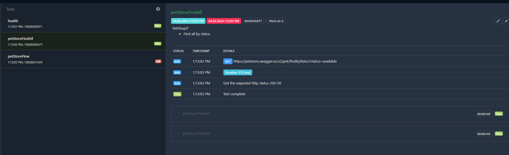

# Automation
This repository is practical shown for `Rest API E2E` tests with `HTML` results written in `Java SE 17`
All execution is easily done with mvn command:

- Isolated REST API test (teamcity step after separated app is deployed)
   ```bash
   mvn verify
   ```
   Optional parameters are
-  -Plocal 
-  -Dfailsafe.suites=src/test/resources/suites/PetStore.xml
    ```bash
    mvn verify -Plocal -Dfailsafe.suites=src/test/resources/suites/PetStore.xml
   ```
That is shown how it could be easily executed for teamcity/jenkins plan. Before suites are executed by `failsafe plugin`
all unit tests run as first by `surfire` plugin. If some unit test fail E2E tests defined in xml suites will be not executed.

## Execute

1. Create local.properties and add into src/test/resources
   com.petstore.url=https://petstore.swagger.io
2. ```mvn test ``` - unit test

3. ```mvn verify ``` - all unit test (surfire plugin),
   if all unit tests will pass then e2e test are executed (failsafe plugin)

## Shown

- Creating client
```java
    @Listeners(TestNgListener.class)
    class PetStoreGenericIT {
    protected Client petStoreClient;
    protected Client anotherBaseAuthClient;
    
	@BeforeClass
    public void init() {

		final String petStoreUrl = KeyProvider.loadProperty("com.petstore.url");

		this.petStoreClient = new Client(UnAuthProvider.builder()
				.url(petStoreUrl)
				.build()
		);

		this.anotherBaseAuthClient = new Client(BasicAuthProvider.builder()
				.url(petStoreUrl)
				.username(KeyProvider.loadProperty("com.petstore.username"))
				.password(KeyProvider.loadProperty("com.petstore.password"))
				.build());
	}
}
   ```
- Creating data
You need to extends JsonRequestResolver (can be simply extend for XmlRequestResolver too) and override specific HTTP methods

```java
  @Builder(toBuilder = true)
  @Getter
  public class PetRequestDto  implements JsonRequestResolver {
	private static final String PATH = "/v2/pet";
	
	private final Status status;
	private final Long id;
	private final String name;
	private final Category category;
	private final List<String> photoUrls;

	public String resolvePostPath(final String url) {
		return url.concat(PATH);
	}

	public String resolvePutPath(final String url) {
		return url.concat(PATH);
	}
}
```  

- Same test using test data driven. Every dataset is executed as child test
   ```java
   @Test(description =
  "<ul>" +
  "<li>Find all by status</li>" +
  "</ul>",
  dataProvider = "petStoreDataset")
  public void petStoreFindAll(final Status status) {
  final ExtentTest extentTest = ExtentReportManager.getTest();
  final var findAll = new FindByStatusRequestDto(status);
  ClientWrapper.get(this.petStoreClient, findAll, extentTest);
  }

  @DataProvider()
  public static Object[][] petStoreDataset() {
  return new Object[][]{
  {Status.AVAILABLE},
  {Status.PENDING},
  {Status.SOLD}
  };
  }
    ```


- test validation failed shown


# Reason
A Lot of companies having Java/Kotlin backend are using Python for E2E testing. This repository is practical shown
how you can create E2E REST API tests which is nice and easy for maintaining using java base. For testers who starting to cover some
Java/Kotlin app with e2e tests feel free to copy paste mentioned code (just rename package) and use it.


# 🛠 Technologies
- Maven
- Git
- Java 17
- TestNG

# © License

[Apache2.0](https://www.apache.org/licenses/LICENSE-2.0)